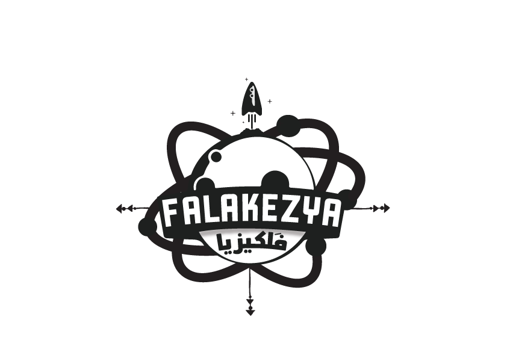

# FALAKEZYA - فَلكيزيا 🌌

<div align="center">



**Jordan's First Physics & Astrophysics Youth Team**

[English](#english) | [العربية](#arabic)

</div>

---

## English

### 🌟 About FALAKEZYA

FALAKEZYA is the first Jordanian youth physics & astrophysics team, founded in October 2018 in Amman under royal guidance. The team is composed of elite physics graduates and passionate youth from universities across the Hashemite Kingdom of Jordan.

As "Knights of Change," FALAKEZYA aims to make physics accessible, engaging, and inspiring for all generations across Jordan by simplifying scientific concepts and spreading astronomical awareness.

### 🎯 Mission & Vision

**Our Mission:**
- Serve all segments of society by simplifying physics
- Break the barrier of fear around science
- Build youth capabilities
- Spread astronomical and physical awareness
- Foster scientific thinking across Jordan

**Our Vision:**
- Create an organized youth hub capable of achieving sustainable development
- Spread correct scientific thinking
- Place Jordan among advanced countries in scientific education

### 🚀 Features of This Website

This is the official landing page for FALAKEZYA, featuring:

- **Bilingual Support**: Full English/Arabic interface with RTL support
- **Responsive Design**: Optimized for all devices (desktop, tablet, mobile)
- **Interactive Starfield Background**: Animated canvas-based cosmic background
- **Achievements Slider**: Showcase of team events and milestones
- **Video Spotlight Section**: Featured team activities and demonstrations
- **Services Overview**: Comprehensive physics programs and workshops
- **Contact Form**: Easy communication channel for inquiries
- **Mobile Navigation**: Smooth mobile menu experience

### 🛠️ Tech Stack

- **HTML5**: Semantic markup structure
- **CSS3**: Custom styling with CSS variables and animations
- **JavaScript (ES6+)**: Interactive functionality and animations
- **Tailwind CSS**: Utility-first CSS framework (via Vite)
- **Vite**: Fast build tool and development server
- **Canvas API**: Interactive starfield background animation

### 📦 Installation & Setup

1. **Clone the repository:**
   ```bash
   git clone https://github.com/khaled-code-a11y/FALAKEZYA-Repo.git
   cd FALAKEZYA-Repo
   ```

2. **Install dependencies:**
   ```bash
   npm install
   ```

3. **Run development server:**
   ```bash
   npm run dev
   ```

4. **Build for production:**
   ```bash
   npm run build
   ```

5. **Preview production build:**
   ```bash
   npm run preview
   ```

### 📁 Project Structure

```
FALAKEZYA-Repo/
├── index.html          # Main HTML file
├── css/
│   └── style.css      # Custom styles and animations
├── js/
│   ├── main.js        # Core JavaScript functionality
│   └── translations.js # English/Arabic translations
├── images/            # Project images and assets
├── package.json       # Project dependencies
├── tailwind.config.js # Tailwind CSS configuration
├── vite.config.js     # Vite build configuration
├── postcss.config.js  # PostCSS configuration
└── README.md          # This file
```

### 🎨 Key Features

#### Internationalization (i18n)
- Full bilingual support (English/Arabic)
- Language toggle with localStorage persistence
- RTL layout support for Arabic
- Comprehensive translation system

#### Interactive Elements
- Animated starfield canvas background
- Touch-friendly slider with swipe gestures
- Video modal with external link support
- Smooth scroll navigation
- Mobile-responsive menu drawer

#### Performance Optimizations
- Vite for fast development and optimized builds
- CSS animations and transitions
- Optimized images
- Lazy loading considerations

### 📱 Responsive Breakpoints

- **Mobile**: < 768px
- **Tablet**: 768px - 1024px  
- **Desktop**: > 1024px

### 🤝 Contributing

Contributions are welcome! If you'd like to contribute to the FALAKEZYA website:

1. Fork the repository
2. Create a feature branch (`git checkout -b feature/AmazingFeature`)
3. Commit your changes (`git commit -m 'Add some AmazingFeature'`)
4. Push to the branch (`git push origin feature/AmazingFeature`)
5. Open a Pull Request

### 📞 Contact Information

- **Email**: falakezya@gmail.com
- **Phone/WhatsApp**: +962 7 9089 8670 | +962 7 8079 0941
- **Location**: Amman, Hashemite Kingdom of Jordan
- **Facebook**: [فريق فَلكيزيا (FALAKEZYA)](https://www.facebook.com/Falakezya)

### 📄 License

This project is © 2026 FALAKEZYA Team. All rights reserved.

### 🙏 Acknowledgments

- Founded in October 2018 under royal guidance
- Supported by top physics graduates from Jordanian universities
- Aligned with His Majesty King Abdullah II's national vision for youth development

---

## العربية

### 🌟 عن فريق فَلكيزيا

فَلكيزيا هو أول فريق شبابي أردني مختص بالفيزياء والفيزياء الفلكية، تأسس في أكتوبر 2018 في عمان استجابةً للتوجيهات الملكية السامية. يتكون الفريق من نخبة من أوائل خريجي تخصص الفيزياء والشباب الموهوبين من الجامعات في جميع أنحاء المملكة الأردنية الهاشمية.

بصفتنا "فرسان التغيير"، يهدف فريق فَلكيزيا إلى جعل الفيزياء في متناول الجميع ومحفزة لجميع الأجيال في الأردن من خلال تبسيط المفاهيم العلمية ونشر الوعي الفلكي.

### 🎯 الرسالة والرؤية

**رسالتنا:**
- خدمة المجتمع بكافة أطيافه في مجال الفيزياء والفيزياء الفلكية
- كسر حاجز الخوف من العلوم
- بناء قدرات الشباب الأردني
- نشر ثقافة التفكير العلمي
- تعزيز الوعي الفلكي والفيزيائي في الأردن

**رؤيتنا:**
- إيجاد بؤرة شبابية منظمة قادرة على تحقيق التنمية المستدامة
- نشر الفكر العلمي الصحيح
- وضع الأردن في مصاف الدول المتقدمة في التعليم العلمي

### 🚀 مميزات الموقع الإلكتروني

هذا هو الموقع الرسمي لفريق فَلكيزيا، ويتميز بـ:

- **دعم ثنائي اللغة**: واجهة كاملة بالإنجليزية والعربية مع دعم RTL
- **تصميم متجاوب**: محسّن لجميع الأجهزة (سطح المكتب، الأجهزة اللوحية، الهواتف)
- **خلفية نجوم تفاعلية**: خلفية كونية متحركة تعتمد على Canvas
- **عارض الإنجازات**: عرض فعاليات الفريق ومحطاته المهمة
- **قسم الفيديو المميز**: عرض أنشطة وفعاليات الفريق
- **نظرة عامة على الخدمات**: برامج وورش عمل فيزيائية شاملة
- **نموذج التواصل**: قناة اتصال سهلة للاستفسارات
- **قائمة موبايل سلسة**: تجربة قائمة متنقلة مريحة

### 🛠️ التقنيات المستخدمة

- **HTML5**: هيكل الترميز الدلالي
- **CSS3**: تنسيقات مخصصة مع متغيرات CSS والرسوم المتحركة
- **JavaScript (ES6+)**: الوظائف التفاعلية والرسوم المتحركة
- **Tailwind CSS**: إطار عمل CSS الأدوات (عبر Vite)
- **Vite**: أداة بناء سريعة وخادم تطوير
- **Canvas API**: خلفية نجوم تفاعلية متحركة

### 📦 التثبيت والإعداد

1. **استنساخ المستودع:**
   ```bash
   git clone https://github.com/khaled-code-a11y/FALAKEZYA-Repo.git
   cd FALAKEZYA-Repo
   ```

2. **تثبيت التبعيات:**
   ```bash
   npm install
   ```

3. **تشغيل خادم التطوير:**
   ```bash
   npm run dev
   ```

4. **البناء للإنتاج:**
   ```bash
   npm run build
   ```

5. **معاينة البناء الإنتاجي:**
   ```bash
   npm run preview
   ```

### 📁 هيكل المشروع

```
FALAKEZYA-Repo/
├── index.html          # ملف HTML الرئيسي
├── css/
│   └── style.css      # التنسيقات المخصصة والرسوم المتحركة
├── js/
│   ├── main.js        # الوظائف الأساسية في JavaScript
│   └── translations.js # الترجمات الإنجليزية/العربية
├── images/            # صور وموارد المشروع
├── package.json       # تبعيات المشروع
├── tailwind.config.js # إعدادات Tailwind CSS
├── vite.config.js     # إعدادات بناء Vite
├── postcss.config.js  # إعدادات PostCSS
└── README.md          # هذا الملف
```

### 🎨 الميزات الرئيسية

#### التدويل (i18n)
- دعم ثنائي اللغة كامل (إنجليزي/عربي)
- زر تبديل اللغة مع الحفظ في localStorage
- دعم تخطيط RTL للعربية
- نظام ترجمة شامل

#### العناصر التفاعلية
- خلفية نجوم متحركة تفاعلية
- شريط تمرير متوافق مع اللمس وإيماءات السحب
- نافذة فيديو مع دعم الروابط الخارجية
- تنقل سلس بالتمرير
- قائمة موبايل متجاوبة

#### تحسينات الأداء
- Vite للتطوير السريع والبناء المحسّن
- رسوم CSS متحركة وانتقالات
- صور محسّنة
- اعتبارات التحميل البطيء

### 📱 نقاط التوقف المتجاوبة

- **الموبايل**: < 768px
- **الأجهزة اللوحية**: 768px - 1024px  
- **سطح المكتب**: > 1024px

### 🤝 المساهمة

المساهمات مرحب بها! إذا كنت ترغب في المساهمة في موقع فَلكيزيا:

1. قم بعمل fork للمستودع
2. أنشئ فرع ميزة (`git checkout -b feature/AmazingFeature`)
3. ا committing التغييرات (`git commit -m 'Add some AmazingFeature'`)
4. ادفع الفرع (`git push origin feature/AmazingFeature`)
5. افتح طلب سحب (Pull Request)

### 📞 معلومات التواصل

- **البريد الإلكتروني**: falakezya@gmail.com
- **الهاتف/واتساب**: 0790898670 | 0780790941
- **الموقع**: عمان، المملكة الأردنية الهاشمية
- **فيسبوك**: [فريق فَلكيزيا](https://www.facebook.com/Falakezya)

### 📄 الترخيص

هذا المشروع © 2026 فريق فَلكيزيا. جميع الحقوق محفوظة.

### 🙏 الشكر والتقدير

- تأسس في أكتوبر 2018 تحت التوجيهات الملكية السامية
- بدعم من نخبة أوائل خريجي الفيزياء من الجامعات الأردنية
- متوافق مع الرؤية الوطنية لجلالة الملك عبدالله الثاني لتطوير الشباب

---

<div align="center">

**Made with ❤️ by Khaled Adel**

*Empowering minds through physics and astrophysics since 2018*

</div>